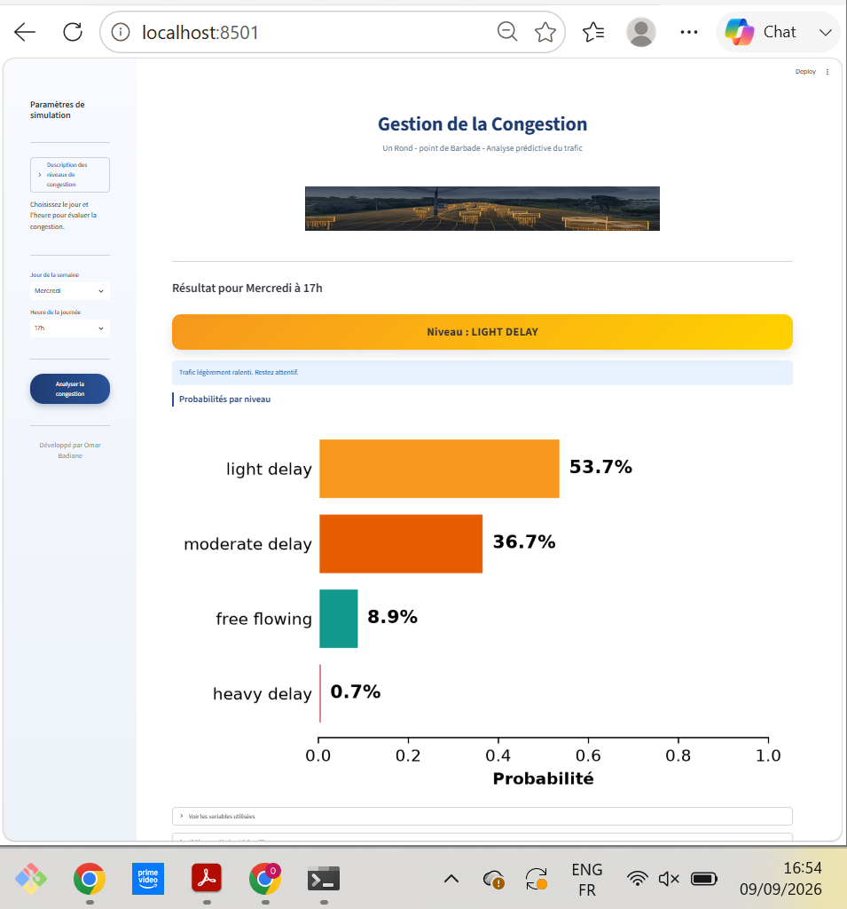

## Tableau de bord de congestion - Barbados

Ce dépôt contient le code source pour un tableau de bord d'analyse et de prédiction de la congestion routière à Barbados.



## Contenu
- `app.py` : application principale.
- `data/` : jeux de données (les gros fichiers CSV sont ignorés par `.gitignore`).
- `src/` : modules utilitaires (`data_loader.py`, `model_loader.py`, `prediction.py`).
- `models/` : modèles  entrainés (fichiers pickle).
- `requirements.txt` : dépendances Python.

## Prérequis
- Python 3.10+ (ou l'interpréteur utilisé pour l'environnement actuel)
- Installer les dépendances :

```powershell
python -m pip install -r requirements.txt
```

## Exécution
- Lancer l'application :

```powershell
streamlit run app.py

```

## Données
- Placez vos fichiers CSV dans le dossier `data/`. Le fichier de données volumineux `barbadostraficcongestion_shifted_df.csv` est ignoré par défaut.
- Lien du fichier CSV: https://drive.google.com/file/d/1cm6BMtDpKtwkwRabNDSNBIE-_HAw4lzo/view?usp=sharing

## Notes
- Vérifiez `src/` pour les fonctions de chargement et de prédiction.


